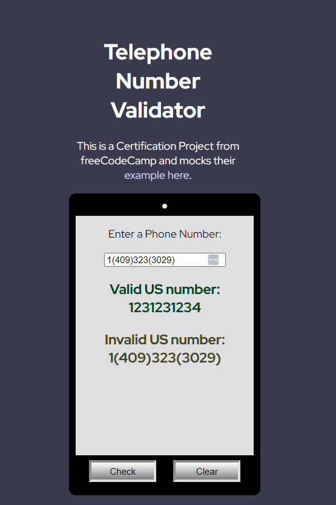

# Telephone Number Validator

This project is a simple web application that validates US telephone numbers. It was created as a Certification Project for freeCodeCamp.

## Table of Contents

* [Overview](https://chatgpt.com/c/abaa2e3d-16a8-4b74-ac97-f37e0267806b#overview)
* [File Structure](https://chatgpt.com/c/abaa2e3d-16a8-4b74-ac97-f37e0267806b#file-structure)
* [Usage](https://chatgpt.com/c/abaa2e3d-16a8-4b74-ac97-f37e0267806b#usage)

## Overview

The Telephone Number Validator allows users to input a phone number and check its validity according to US phone number formatting rules. The application provides instant feedback on whether the number entered is valid or not.

## File Structure

The project consists of the following main files:

1. **index.html**
2. **styles.css**
3. **script.js**

### index.html

This file contains the structure of the web page. It includes a form for inputting the phone number, a section to display the results, and buttons for checking and clearing the input.

### styles.css

This file contains the styling for the web page, including layout, colors, fonts, and other design elements to make the application visually appealing.

### script.js

This file contains the JavaScript logic for the application. It includes event listeners for the buttons, validation logic using a regular expression, and functionality to display the validation results.

## Preview

## Usage

To use the Telephone Number Validator, follow these steps:

1. Open `index.html` in a web browser.
2. Enter a US phone number in the input field.
3. Click the "Check" button to validate the number.
4. The result will be displayed below the input field, indicating whether the number is valid or invalid.
5. Click the "Clear" button to reset the input field and clear the results.
